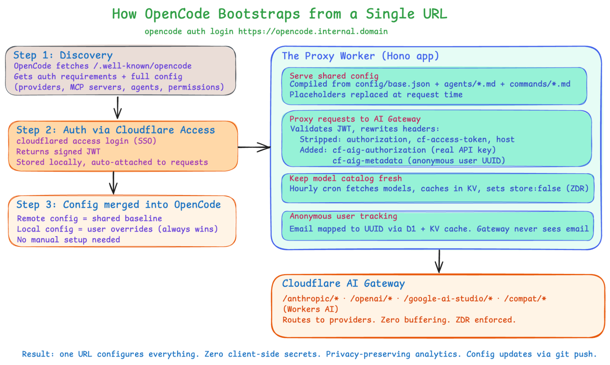

# opencode-access

Cloudflare Workers template for securing OpenCode access to LLMs through Cloudflare Access and AI Gateway.
## Why This Pattern

This template follows the same core pattern described in Cloudflare's post on [the internal AI engineering stack](https://blog.cloudflare.com/internal-ai-engineering-stack/#how-ai-gateway-helped-us-stay-secure-and-improve-the-developer-experience):

- Cloudflare Access handles authentication and zero-trust policy enforcement.
- A single Worker becomes the control point for OpenCode bootstrap, auth validation, model allowlisting, and request rewriting.
- AI Gateway centralizes provider keys, routing, logging controls, spend visibility, and retention policy enforcement.
- The Worker sends AI Gateway only an anonymous per-user UUID backed by D1 and KV, not the user's email.



> [!NOTE]
> The automatic catalog refresh shown in the architecture diagram is not included in this repository.

In practice, that gives you:

- One discovery URL for OpenCode bootstrap.
- No provider secrets on developer laptops.
- A central place to enforce model access and request policy.
- Privacy-preserving per-user attribution for AI Gateway analytics.
- Config-as-code via `config/opencode.json`.

## Setup

Prerequisites:

- Node.js 20+
- Terraform 1.2+
- A Cloudflare account with Zero Trust enabled
- A custom hostname on a Cloudflare-managed zone

Create a Cloudflare API token with these permissions:

- Account: `Workers Scripts` Edit
- Account: `AI Gateway` Edit
- Account: `Access: Apps` Edit
- Account: `Access: Policies` Edit
- Account: `API Tokens` Write
- Account: `API Tokens` Read
- Account: `D1` Edit
- Account: `Workers KV Storage` Edit
- Zone: `DNS` Edit
- Zone: `Workers Routes` Edit

Then run:

```bash
npm install
cp .env.example .env
# fill in the required values in .env
npm run setup
```

The setup script will:

1. Bundle the Worker with Wrangler.
2. Resolve the AI Gateway permission group needed for a scoped runtime token.
3. Run Terraform to create the AI Gateway, Access application and policy, scoped AI Gateway token, anonymous-user KV namespace, anonymous-user D1 database, Worker, and custom domain.
4. Apply the D1 schema migrations for the anonymous-user database.
5. Use a temporary Wrangler config during setup so migrations target the Terraform-created KV and D1 resources without rewriting `wrangler.jsonc`.
6. Write back the Access AUD, Worker URL, discovery URL, AI Gateway token ID, and generated KV/D1 IDs into `.env`.

The script enforces `CUSTOM_HOSTNAME` and `CLOUDFLARE_ZONE_ID`; `workers.dev` is not used for production.

## Deploying Updates

```bash
npm run deploy
```

Use `npm run deploy` after the stack already exists and you only want to push Worker code/config changes.

`npm run deploy`:

- requires an existing Terraform state from `npm run setup`
- re-bundles the Worker
- reapplies only the Worker update path in Terraform
- does not create or reconcile the AI Gateway
- does not rewrite generated `.env` outputs

Use `npm run setup` when you are doing the first install, changing infrastructure settings, or you want the script to reconcile the full stack and refresh generated `.env` values.

## Tearing Down

```bash
npm run teardown
```

This destroys all Terraform-managed resources and clears the auto-generated deployment values from `.env`.

## Required `.env` Values

- `CLOUDFLARE_API_TOKEN`
- `CLOUDFLARE_ACCOUNT_ID`
- `TEAM_DOMAIN`
- `CUSTOM_HOSTNAME`
- `CLOUDFLARE_ZONE_ID`

## Post-Setup Dashboard Work

The script provisions the infrastructure, but you still need to configure your org-specific access and model routing choices:

1. Configure your Cloudflare Access identity provider if you do not want the default account-wide IdP behavior.
2. Tighten the Access policy if you do not want the default broad allow rule.
3. Configure AI Gateway providers, Unified Billing, or BYOK in the Cloudflare dashboard.

## Local Development

Local development also uses `.env` as the single source of truth:

```bash
cp .env.example .env
# set TEAM_DOMAIN / POLICY_AUD / AIG_AUTH_TOKEN as needed for local testing
npm run dev
```

`npm run dev` applies the local D1 migrations before starting Wrangler so anonymous user tracking works in local development and tests.

## How It Works

1. OpenCode fetches `https://your-domain/.well-known/opencode`.
2. The Worker returns the OpenCode `{ auth, config }` envelope, including the `cloudflared access login` command and a provider base URL pointing at `https://your-domain/v1`.
3. OpenCode authenticates with Cloudflare Access and sends the signed JWT on subsequent requests.
4. The Worker validates the JWT, maps the Access email to an anonymous UUID stored in D1 and cached in KV, strips client-side auth headers, and injects the server-side AI Gateway token.
5. AI Gateway routes the request to your configured provider and applies your centralized controls.

The result is the same operating model described in the blog post: one client URL, centralized routing and policy, and no provider credentials on end-user machines.

## Customization

The landing page lives in `public/index.html` and is served by the Workers Assets binding.
Edit it to match your organization's branding or onboarding steps.

Models, names, limits, and the default/small model pointers all live in `config/opencode.json`.
It is a standard OpenCode config template with four placeholders resolved at request time:

- `{providerId}` from `OPENCODE_PROVIDER_ID`
- `{providerName}` from `OPENCODE_PROVIDER_NAME`
- `{baseURL}` from the request origin
- `{ENV_NAME}` is always `OPENCODE_ACCESS_TOKEN`

## Endpoints

- `GET /`
  - Static landing page served from `public/index.html`.
  - Shown after a successful `cloudflared access login` flow.
- `GET /.well-known/opencode`
  - Public bootstrap endpoint exposed by a narrower Access bypass application.
- `GET /healthz`
  - Public health check exposed by a narrower Access bypass application.
- `GET /v1/models`
  - Access-protected OpenAI-compatible model list.
- `POST /v1/chat/completions`
  - Access-protected chat completions proxy.

## OpenCode Usage

Point OpenCode at the discovery URL after setup:

```bash
opencode auth login https://your-domain
```

After login, OpenCode will use the org-managed provider config from the Worker and send all model traffic through AI Gateway.

## Test

```bash
npm test
```
